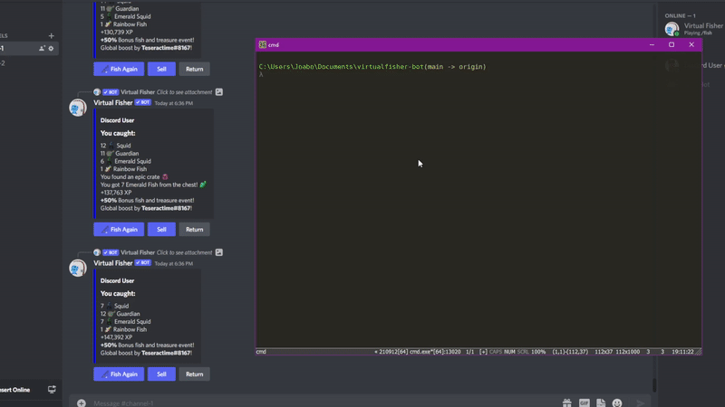
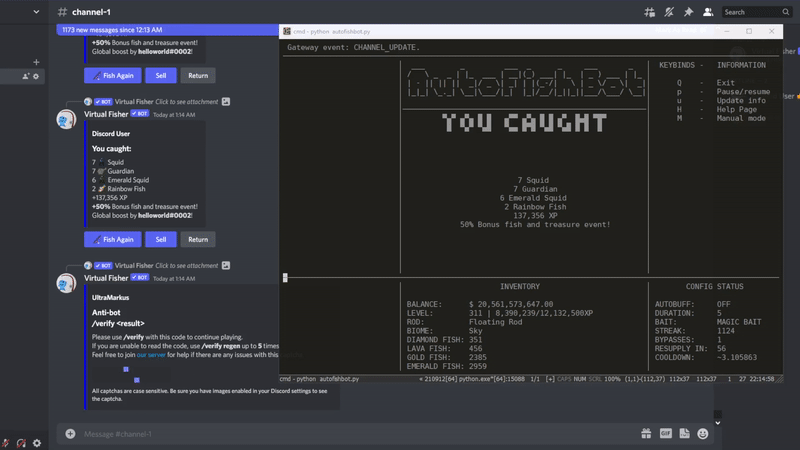
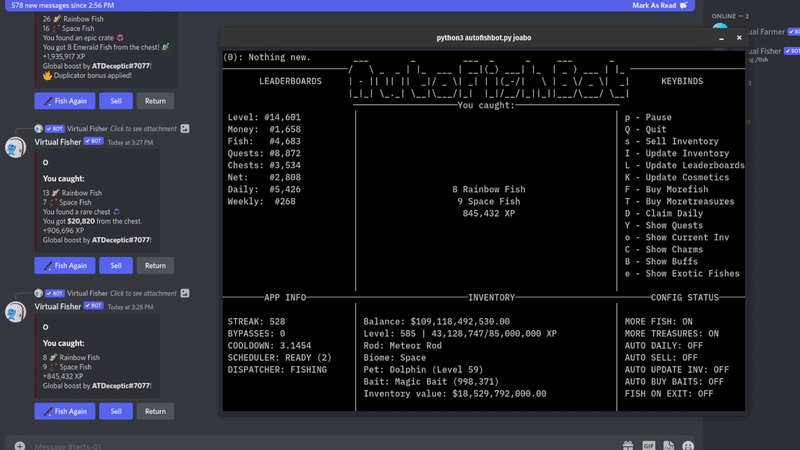

# AFB - Autofishbot
Auto fishing bot made in Python 3 for [Virtual Fisher](https://virtualfisher.com/) Discord bot.

## Features
- Auto Fish 
- Menu (TUI)
- Captcha Bypass [*](#captcha-information)
- Full-featured (auto boosts, auto daily, auto sell, and +)
- Interactions (buttons and slash commands)

**Note**: the **experimental-2.0.0** (current) version is still under development, if you are having problems, a stable release (**1.2.1.1**) can be found [here](assets/stable-legacy/stable-1.2.1.1.zip).

## Demo


## Requirements
- Python [3.10.6](https://www.python.org/downloads/release/python-3106/) or [later versions](https://www.python.org/downloads/)
- [Git](https://git-scm.com/downloads) (optional)

## Installation and Update
(**With** Git) 
- Using the terminal, type:
```bash
git clone https://github.com/thejoabo/autofishbot.git
cd autofishbot
python -m pip install -r requirements.txt
```
(**Without** Git)
- Download the repository [here](https://github.com/thejoabo/autofishbot/archive/refs/heads/main.zip)
- Extract the zip file
- Open a terminal window in the extracted folder and type:
```bash
python -m pip install -r requirements.txt
``` 
## Usage
Using the terminal, **in the repository folder**, type:
```bash
python autofishbot.py 
```
**Notes**:
- You can use ```python autofishbot.py config_name``` to run the bot with a specific config file.
- You can use ```python autofishbot.py --create``` to create a new config file.
- In the first startup, the bot will ask you to fill the configuration file name (which will be stored at '```{autofishbot directory}/configs/```' folder). After setting everything up, run the command again. In case of several config files, you will be prompted to choose one.

## Customization

You can easily customize the options listed below in the automatically generated [config file](assets/template.config):

```conf
#Example
[SYSTEM]
user_token = M@yToke_n123
user_cooldown = 3.5
channel_id = 123456
debug = False

[CAPTCHA]
ocr_api_key = MyK!ey12.3

[NETWORK]
user_agent = 
proxy_ip =
proxy_port =
proxy_auth_user = 
proxy_auth_password = 

[AUTOMATION]
boosts_length = 5
more_fish = True
more_treasures = False
fish_on_exit = True
auto_daily = True
auto_buy_baits = False
auto_sell = True
auto_update_inventory = False

[MENU]
compact_mode = False
refresh_rate = 0.3

[COSMETIC]
pet = dolphin
bait = fish
biome = ocean
```
Detailed information [here](assets/faq.md).


## Captcha Information
All captchas are solved using the OCR.SPACE API for image to text recognition. The reason for choosing an online API was to avoid the annoyance of forcing users to install heavy image recognition modules (and saving the unnecessary effort of creating a specific image recognition model for this type of captcha). Among the API options, the most practical and accessible for the user is OCR.SPACE and, furthermore, it presented a reasonable consistency in correctly identifying the text in the image in the tests performed. **Therefore, to automatically solve the captchas, you will need an [API KEY](#how-do-i-get-my-free-key-)**.

The methodology is quite straight forward, when a new captcha is detected:

1. A request is sent asynchronously to the API for each available OCR engine
2. The answers are filtered to assert those with reasonable certainty 
3. The filtered answers are tested

If all tests fail, a request to regenerate the captcha will be sent (up to 3 times). If the bot, ultimately, fails to solve all captchas, it will wait until you solve it manually.

Keep in mind that the captcha detection method is not flawless, unexpected events can cause some unusual behavior that could influence detection accuracy. Therefore, it should not be left alone without monitoring for longer periods of time.
### Demo (normal)


### Demo (with regen)


### HOW DO I GET MY **FREE** KEY ?

All you need to do is use [any](https://temp-mail.io/en) email to get it here: https://ocr.space/ocrapi/freekey.

[Need more help ?](assets/faq.md#ocr_api_key)


## Changelog
### experimental-2.0.0 - 11/20/22 (current)
#### **Added**
- added **Scheduler** class (#38) - experimental
  - Allows slash commands to be sent using keybinds
  - Creates, controls and pseudo-randomizes automation routines (boosts and auto_* features) → attempts to mimic human behavior
  - Sporadically mid-session 'break time'
- **DiscordWrapper** new features
  - added **Proxy** class integration
    - native proxy support (**HTTPS only**)
  - session reconnections
- **Menu** new features
  - **BaseMenu**
    - support for custom keybinds ('*./app/keybinds.json*') by **Keybinder** class
    - CPU and Memory consumption reduced - better logic and structure overall (removed redundant calculations and  function calls, simplification, +)
    - asynchronous notifications 'server' (threaded) → notifications are now queued and have priority and display time
    - 'Config Status' panel split in 'App info' and 'Config Status' (with better choices of information to be displayed)
    - **Popup** widget → extra information (like quests, exotic fishes, current inventory, charms and buffs) can be viewed in a popup format (see example) 
  - **MainMenu(BaseMenu)** - "normal" mode
    - design changes ([see comparison](https://imgur.com/a/tQSEXG3))
    - screen strings are now resized dynamically to fit the terminal size
    - added the Leaderboards panel
    - added more profile information to the Inventory panel
    - better exceptions handling 
  - **CompactMenu(BaseMenu)** - compact mode
    - minor design changes ([see comparison](https://imgur.com/a/tsIcg5O))
    - better exceptions handling 
- **ConfigManager** new features
  - argument support for loading specific configs  (e.g. ```python autofishbot.py some_config_name```) (adaptation of @notvirtio 's solution #51)
  - support for the creation of new (alt) configs using arguments (```python autofishbot.py --create```)
  - new parameters:
    - Network: ```proxy_ip```, ```proxy_port```, ```proxy_auth_user```, ```proxy_auth_password```, ```user_agent```
    - Automation:
      - added ```auto_sell```, ```auto_buy_baits```, ```auto_update_inventory```, ```auto_daily```
      - splitted ```auto_buff``` in ```more_fish``` and ```more_treasures```
      - renamed ```buff_length``` to ```boosts_length```
    - Menu: ```refresh_rate```
    - Cosmetic: ```pet```, ```bait```, ```biome``` (**not yet implemented**)
- **Profile** new features
  - support to charms inventory (*/charms*) + **Charms** datatype class
  - support to user leaderboards (*/pos*) + **Leaderboard** datatype class
  - support to buffs (multipliers list) (*/buffs*) + **Buffs** datatype class
  - support to quests list (*/quests*) + **QuestList** and **Quest** datatype class
#### **Changed**
- refactored **DiscordWrapper** class
  - discord's API (v9 → v10)
  - *connect* function's structure
  - heartbeat routine (adjusting to documentation requirements)
  - *receive_event* function (better error management and pre deserialization)
  - application commands and guild ID are now loaded on start-up
  - *request* function (discord's HTTP API requests):
    - simplification and better data structure
    - better handling of exceptions (and proper returns)
    - better error management to failure requests
    - proper handling of discord's rate limits (429 error) (improvement of @gabeaventh 's solution #36)
- refactored **Captcha** class
  - compartmentalization
  - multi-threading solving (asynchronous ocr-engine requests) → each engine request is made simultaneously, so captcha solving time is significantly faster.
  - captcha detection function (added conditional safeguards)
  - status flags (ensuring transparency of actions for external classes)
- *message_dispatcher* function converted to **Dispatcher** class
  - improvements in conditional gates to send commands (safer method)
  - "**pause**" property, to globally pause the dispatcher (instead of a standalone class)
  - improvements in sending captcha-related commands 
  - improvements in cooldown calculations (to consider for network ping between requests oscillations/processing time, in order to preserve the Gaussian approach of value generation)
- *message_receiver* function converted to **Receiver** class
  - better event checking, parsing and validation
  - simplification (removed unnecessary event validation, improvements in code structure, +)
  - improvements in messages categorization
  - untitled (and unhandled) messages are now properly sanitized and displayed on notifications
  - better logic to detect captchas in raw events
  - incorrect captcha code messages are now treated
  - added of more breakpoints conditionals (in case of abnormal behavior)
- refactored **Profile** class
  - compartmentalization
  - attribute fields (instead of a global fixed list)
  - lists (displayed on menu) are now constructed individually per attribute (datatype classes) using the *list* property
  - *update* function 
  - gold, diamond, emerald and lava fishes are now grouped to **ExoticFish** class
- refactored **CooldownManager** class
  - simplification
  - analysis functions removed
- refactored **Message** class
  - better message parsing and fields categorization
  - untitled and contentless message are now handled
- refactored **ConfigManager** class
  - better loading/saving logic of config files
  - compartmentalization of config parameters (system, captcha, network, automation, menu and cosmetic)
  - better value parsing and validation
- refactored **Debugger** class
  - simplification
  - outputs errors and exceptions to 'debug.log' file instead of displaying them on terminal
- **PauseControl** class removed (integrated in **Dispatcher** class)
-  **MenuManager** class removed (split in **BaseMenu**, **MainMenu(BaseMenu)**, **CompactMenu(BaseMenu)** classes)
- *autoBuff* function removed (integrated in **Scheduler** class)
#### **Fixed**
- fixed a bug in which the *sanitize* function in Message class couldn't parse some characters
- fixed a bug in which  required fields weren't validated in ConfigManager (#48)
- fixed a bug in which captcha.regen counter were redefined after solution failure
- fixed a bug in which the bait name overlaps the border in compact mode - inventory (and related information) can be viewed separately on a popup using their respective keybinds (#50)
- fixed a bug in which the curses kept blinking on screen's last update position
- 
...

[FULL CHANGELOG HERE](assets/changelog.md)


## Contributing
- Pull requests are welcome. For major changes, open an issue first to discuss what you would like to change.
- If you notice any errors, bugs or strange behavior **[PLEASE OPEN AN ISSUE](https://github.com/thejoabo/virtualfisher-bot/issues/new)** containing a screenshot or describing the problem.
- [**Suggestions**](https://github.com/thejoabo/virtualfisher-bot/discussions/new) and [**Pull requests**](https://github.com/thejoabo/virtualfisher-bot/pulls) are welcome.

